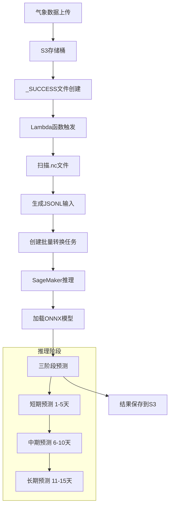
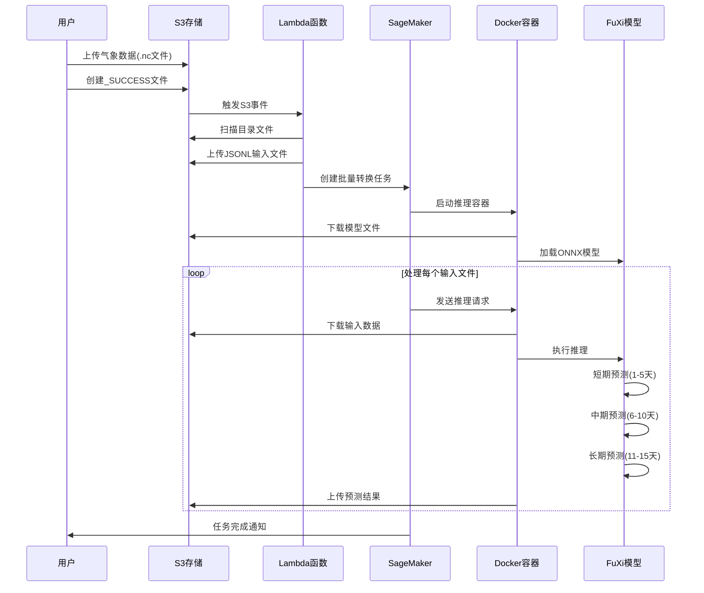
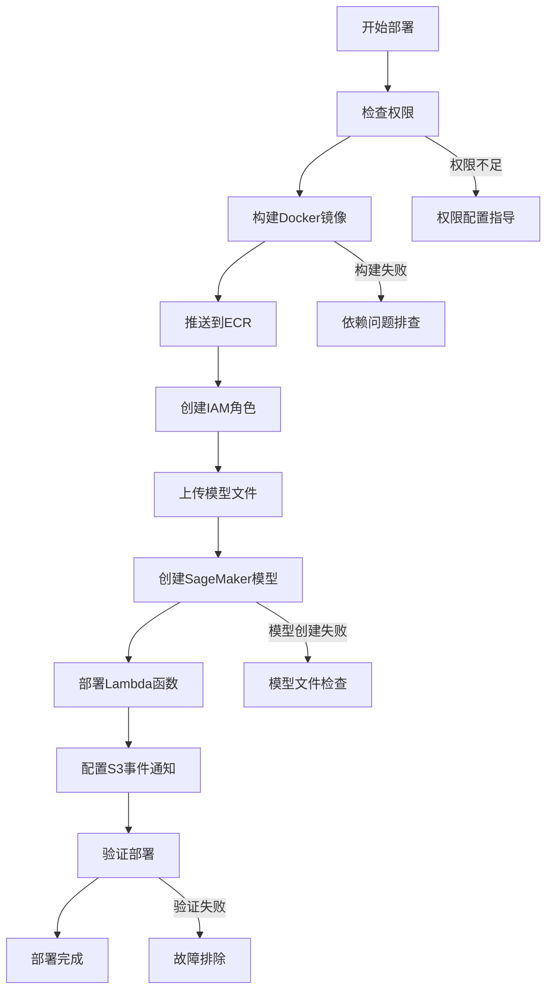

# FuXi Weather Model - 架构分析文档

## 📋 文档概述

本文档详细分析 FuXi 天气预报模型在 AWS SageMaker 上的部署架构，包括总体架构设计、各模块详细分析、数据流程、时序图以及关键概念定义。

---

## 🏗️ 总体架构

### 系统架构图

```
┌─────────────────────────────────────────────────────────────────────────────┐
│                           FuXi Weather Forecast System                      │
├─────────────────────────────────────────────────────────────────────────────┤
│                                                                             │
│  ┌─────────────┐    ┌──────────────┐    ┌─────────────────┐                │
│  │   数据源     │    │   S3 存储    │    │   Lambda 触发   │                │
│  │ (气象数据)   │───▶│   (.nc文件)  │───▶│   (事件处理)    │                │
│  └─────────────┘    └──────────────┘    └─────────────────┘                │
│                                                    │                        │
│                                                    ▼                        │
│  ┌─────────────┐    ┌──────────────┐    ┌─────────────────┐                │
│  │  预测结果   │◀───│  SageMaker   │◀───│  批量转换任务   │                │
│  │ (输出到S3)  │    │   推理服务   │    │   (任务调度)    │                │
│  └─────────────┘    └──────────────┘    └─────────────────┘                │
│                            │                                                │
│                            ▼                                                │
│                    ┌──────────────┐                                        │
│                    │ 自定义Docker │                                        │
│                    │   推理镜像   │                                        │
│                    └──────────────┘                                        │
└─────────────────────────────────────────────────────────────────────────────┘
```

### 核心组件

1. **数据存储层 (S3)**
   - 输入数据存储 (.nc 格式气象文件)
   - 模型文件存储 (ONNX 模型)
   - 输出结果存储 (预测数据)

2. **事件处理层 (Lambda)**
   - S3 事件监听
   - 批量任务触发
   - 数据预处理

3. **推理计算层 (SageMaker)**
   - 批量转换任务
   - GPU 加速推理
   - 自动扩缩容

4. **容器化层 (Docker/ECR)**
   - 自定义推理环境
   - 预装依赖库
   - 优化启动时间

---

## 🔧 模块架构分析

### 1. Docker 容器模块

**目录结构:**
```
docker/
├── Dockerfile              # 镜像定义
├── requirements.txt         # Python 依赖
├── build.sh                # 构建脚本
└── check_permissions.sh     # 权限检查
```

**架构特点:**
- 基于 AWS SageMaker PyTorch 推理镜像
- 预装气象数据处理库 (cfgrib, xarray, h5netcdf)
- GPU 加速支持 (CUDA + ONNX Runtime GPU)
- 中国区域优化 (清华源加速)

### 2. 模型推理模块

**目录结构:**
```
model/
├── inference.py            # SageMaker 推理入口
├── util.py                # 工具函数
└── model.tar.gz           # 模型包
```

**核心功能:**
- `model_fn()`: 模型加载和初始化
- `input_fn()`: 输入数据预处理
- `predict_fn()`: 推理执行
- 支持三阶段预测 (短期/中期/长期)

### 3. Lambda 函数模块

**目录结构:**
```
lambda/
└── function.py            # 事件处理函数
```

**处理流程:**
1. 监听 S3 `_SUCCESS` 文件事件
2. 扫描目录下的 .nc 文件
3. 生成 JSONL 格式输入数据
4. 创建 SageMaker 批量转换任务

### 4. 部署脚本模块

**目录结构:**
```
scripts/
├── deploy.py              # 主部署脚本
└── setup_models.sh        # 模型设置脚本
```

**部署功能:**
- 自动创建 IAM 角色
- SageMaker 模型创建
- Lambda 函数部署
- S3 事件通知配置

---

## 📊 数据流程图



---

## ⏱️ 时序图



---

## 🔑 关键概念定义

### 技术概念

**1. ONNX (Open Neural Network Exchange)**
- 开放神经网络交换格式
- 支持跨平台模型部署
- 优化推理性能，支持GPU加速

**2. SageMaker 批量转换**
- AWS托管的批量推理服务
- 自动扩缩容，按需付费
- 支持大规模数据处理

**3. Docker 容器化**
- 封装运行环境和依赖
- 保证部署一致性
- 快速启动和扩展

### 业务概念

**1. FuXi 天气模型**
- 基于深度学习的天气预报模型
- 支持全球范围天气预测
- 三个时间尺度：短期、中期、长期

**2. 气象数据格式**
- **NetCDF (.nc)**: 网络通用数据格式，存储多维科学数据
- **GRIB**: 气象信息二进制格式，国际标准
- **JSONL**: JSON Lines格式，每行一个JSON对象

**3. 预测时间尺度**
- **短期预测**: 1-5天，20个时间步
- **中期预测**: 6-10天，20个时间步  
- **长期预测**: 11-15天，34个时间步

### AWS 服务概念

**1. IAM 角色**
- **SageMaker执行角色**: 访问S3、ECR等服务权限
- **Lambda执行角色**: 调用SageMaker、访问S3权限

**2. S3 事件通知**
- 对象创建事件触发
- `_SUCCESS` 文件作为处理完成标志
- 自动化数据处理流程

**3. ECR (Elastic Container Registry)**
- Docker镜像存储仓库
- 与SageMaker集成
- 支持镜像版本管理

---

## 🔍 详细模块分析

### Docker 推理容器架构

```
┌─────────────────────────────────────────────────────────────┐
│                    Docker 推理容器                          │
├─────────────────────────────────────────────────────────────┤
│  基础镜像: PyTorch 2.0.1 + CUDA 11.8 + Ubuntu 20.04       │
│                                                             │
│  ┌─────────────────┐  ┌─────────────────┐                  │
│  │   系统依赖库     │  │   Python 依赖   │                  │
│  │ - libeccodes    │  │ - onnxruntime   │                  │
│  │ - libnetcdf     │  │ - xarray        │                  │
│  │ - libhdf5       │  │ - cfgrib        │                  │
│  └─────────────────┘  └─────────────────┘                  │
│                                                             │
│  ┌─────────────────────────────────────────────────────────┐│
│  │              推理代码层                                  ││
│  │  - inference.py (SageMaker入口点)                      ││
│  │  - util.py (工具函数)                                   ││
│  │  - 模型加载和推理逻辑                                    ││
│  └─────────────────────────────────────────────────────────┘│
└─────────────────────────────────────────────────────────────┘
```

**关键特性:**
- **预装优化**: 所有依赖预装，避免运行时安装
- **GPU加速**: CUDA + ONNX Runtime GPU 支持
- **中国区优化**: 使用清华源加速包安装
- **健康检查**: 内置依赖验证机制

### SageMaker 推理流程

```python
# 推理流程伪代码
def sagemaker_inference_flow():
    # 1. 模型初始化阶段
    model_dir = model_fn('/opt/ml/model')
    
    # 2. 输入处理阶段  
    input_data = input_fn(request_body, content_type)
    
    # 3. 推理执行阶段
    result = predict_fn(input_data, model_dir)
    
    # 4. 输出处理阶段
    return output_fn(result, accept)
```

**三阶段推理架构:**
1. **短期模型** (short.onnx): 处理1-5天预测，20个时间步
2. **中期模型** (medium.onnx): 处理6-10天预测，20个时间步
3. **长期模型** (long.onnx): 处理11-15天预测，34个时间步

### Lambda 事件处理架构

```
┌─────────────────────────────────────────────────────────────┐
│                  Lambda 函数架构                            │
├─────────────────────────────────────────────────────────────┤
│                                                             │
│  ┌─────────────┐    ┌─────────────┐    ┌─────────────┐      │
│  │ S3 事件接收 │───▶│ 文件扫描处理 │───▶│ 任务创建提交 │      │
│  └─────────────┘    └─────────────┘    └─────────────┘      │
│         │                   │                   │           │
│         ▼                   ▼                   ▼           │
│  ┌─────────────┐    ┌─────────────┐    ┌─────────────┐      │
│  │解析事件记录  │    │生成JSONL数据│    │配置推理参数  │      │
│  │提取桶和键值  │    │文件配对逻辑  │    │设置环境变量  │      │
│  └─────────────┘    └─────────────┘    └─────────────┘      │
└─────────────────────────────────────────────────────────────┘
```

**处理逻辑:**
- **事件过滤**: 只处理 `_SUCCESS` 文件事件
- **文件配对**: 将 .nc 文件两两配对处理
- **批量优化**: 生成 JSONL 格式批量输入
- **错误处理**: 完善的异常处理和日志记录

---

## 📈 性能优化策略

### 1. 容器启动优化
- **预装依赖**: 避免运行时安装延迟
- **镜像分层**: 优化Docker层缓存
- **健康检查**: 快速验证环境就绪

### 2. 推理性能优化
- **GPU加速**: ONNX Runtime GPU 提供硬件加速
- **内存管理**: 优化ONNX Runtime内存配置
- **并行处理**: 支持多实例并行推理

### 3. 数据传输优化
- **S3传输**: 优化上传下载策略
- **临时存储**: 使用 /tmp 目录减少I/O
- **文件清理**: 及时清理临时文件

---

## 🔒 安全架构

### IAM 权限模型

```
┌─────────────────────────────────────────────────────────────┐
│                    IAM 权限架构                              │
├─────────────────────────────────────────────────────────────┤
│                                                             │
│  ┌─────────────────────┐    ┌─────────────────────┐         │
│  │  SageMaker 执行角色  │    │  Lambda 执行角色    │         │
│  │                     │    │                     │         │
│  │ ✓ S3 读写权限       │    │ ✓ SageMaker 调用    │         │
│  │ ✓ ECR 镜像拉取      │    │ ✓ S3 读写权限       │         │
│  │ ✓ CloudWatch 日志   │    │ ✓ CloudWatch 日志   │         │
│  └─────────────────────┘    └─────────────────────┘         │
│                                                             │
│  ┌─────────────────────────────────────────────────────────┐│
│  │                最小权限原则                              ││
│  │  - 仅授予必要的服务权限                                  ││
│  │  - 资源级别的访问控制                                    ││
│  │  - 定期权限审计和更新                                    ││
│  └─────────────────────────────────────────────────────────┘│
└─────────────────────────────────────────────────────────────┘
```

### 数据安全
- **传输加密**: S3 和 SageMaker 间数据传输加密
- **存储加密**: S3 服务端加密
- **访问控制**: 基于 IAM 的细粒度权限控制

---

## 🚀 扩展性设计

### 水平扩展
- **SageMaker 实例**: 支持多实例并行处理
- **Lambda 并发**: 自动扩展处理能力
- **S3 分区**: 支持大规模数据存储

### 垂直扩展  
- **GPU 实例**: 支持更强大的 GPU 实例类型
- **内存优化**: 可配置实例内存大小
- **存储优化**: 支持不同存储类型

---

## 📊 监控和运维

### 监控指标
- **推理延迟**: SageMaker 批量转换任务执行时间
- **错误率**: Lambda 函数和推理任务失败率
- **资源利用率**: GPU、CPU、内存使用情况
- **数据吞吐量**: 处理的数据文件数量和大小

### 日志管理
- **CloudWatch 日志**: 集中化日志收集
- **结构化日志**: JSON 格式便于查询分析
- **日志级别**: 支持不同详细程度的日志输出

### 告警机制
- **任务失败告警**: 推理任务异常终止
- **资源超限告警**: CPU/内存/GPU 使用率过高
- **数据异常告警**: 输入数据格式或内容异常

---

## 🔄 部署流程

### 自动化部署流程



### 部署验证
- **镜像验证**: 确认 ECR 镜像存在且可访问
- **模型验证**: 检查 S3 模型文件完整性
- **权限验证**: 验证 IAM 角色权限配置
- **功能验证**: 端到端推理流程测试

---

*架构分析文档完成 - 最后更新: 2025年8月14日*
